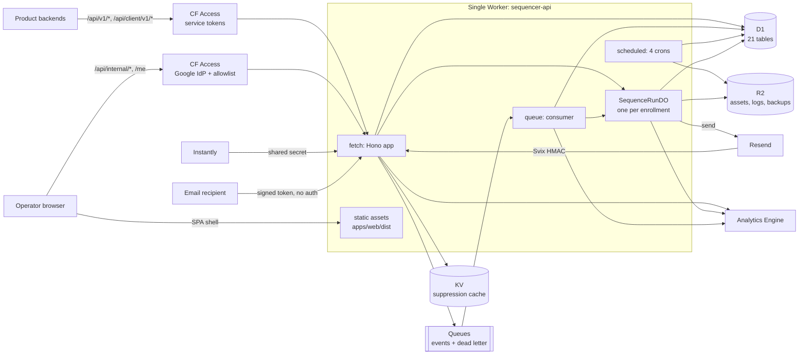
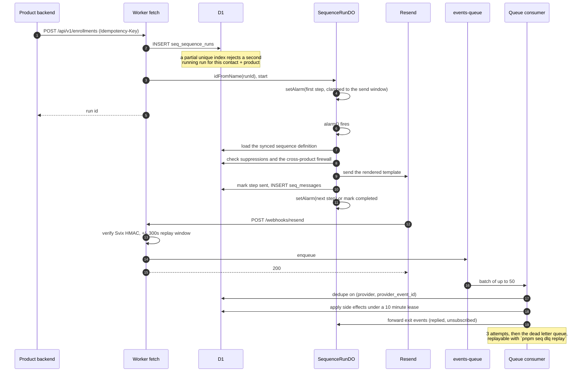
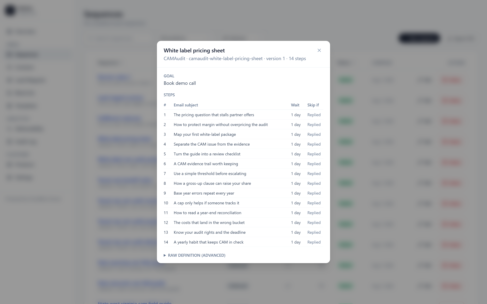
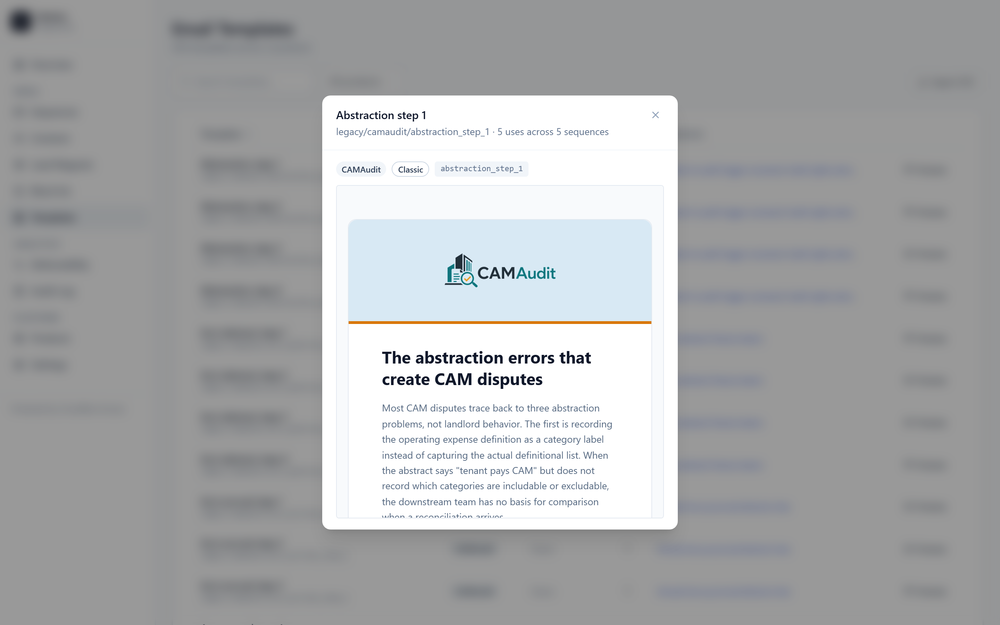
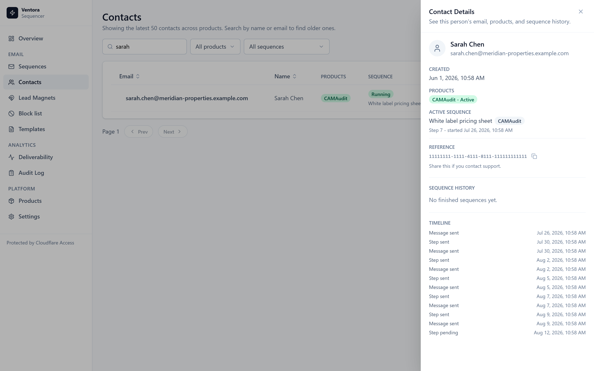
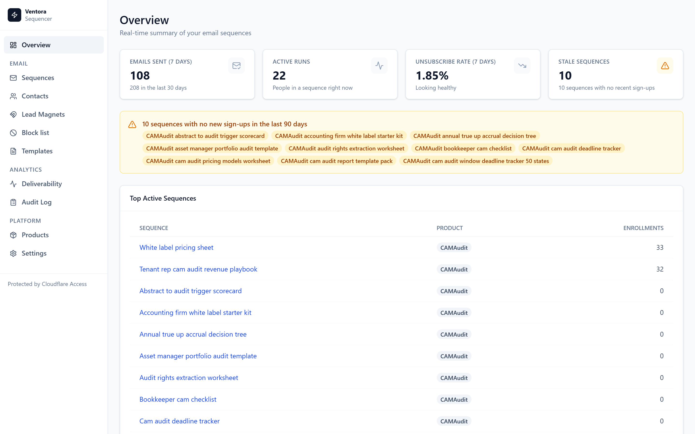

# Ventora Sequencer

A multi-tenant email sequence engine built entirely on Cloudflare Workers. Sequences are
authored as YAML, compiled by a purpose-built CLI, and executed by one Durable Object per
enrollment driven by alarms. It was internal infrastructure for a small portfolio of products:
their backends called its API to enroll people, and one operator ran everything from a
dashboard. It sent real mail for two live products.

> [!IMPORTANT]
> Archived 2026-07-13 into a private monorepo as a git subtree; the last commit touching it was
> 2026-08-11. The Worker is not deployed and the domain does not serve it.

The interesting problem is the one underneath: **a Durable Object alarm can fire more than
once, and a sent email cannot be taken back.** See [below](#the-hard-part-not-sending-twice).

> [!NOTE]
> Built by Angel Campa ([@AngelCampa1](https://github.com/AngelCampa1)). Source available for
> reading and evaluation. No license to use, copy, modify, or redistribute is granted: see
> [LICENSE](LICENSE).

**Cloudflare Workers** (Hono), **D1** + Drizzle, **Durable Objects**, **Queues**, **KV**,
**R2**, **Analytics Engine**, **Cloudflare Access**, **React 19** + Vite + Tailwind,
**Resend**, **Sentry**

[](portfolio/SCREENSHOTS.md)

<sub>Domain health, one row per domain per day, with inline SVG sparklines. The operator
dashboard is ten pages, served as static assets by the same Worker that runs the API. **The
numbers in every screenshot are local seed data, not production traffic** (see
[Notes on the data](portfolio/SCREENSHOTS.md#notes-on-the-data)).
**[Full gallery, 41 captures](portfolio/SCREENSHOTS.md)**</sub>

## Contents

- [If you read one thing](#if-you-read-one-thing)
- [What it did](#what-it-did)
- [Architecture](#architecture)
- [How one email actually gets sent](#how-one-email-actually-gets-sent)
- [The hard part: not sending twice](#the-hard-part-not-sending-twice)
- [Engineering highlights](#engineering-highlights)
- [By the numbers](#by-the-numbers)
- [Testing](#testing)
- [The `seq` CLI](#the-seq-cli)
- [Screenshots](#screenshots)
- [Repository map](#repository-map)
- [Documentation](#documentation)
- [Built with AI agents](#built-with-ai-agents)
- [Running it locally](#running-it-locally)
- [Who built this](#who-built-this)
- [License](#license)

## If you read one thing

Read **[The hard part: not sending twice](#the-hard-part-not-sending-twice)** below, then
**[portfolio/ENGINEERING-LOG.md](portfolio/ENGINEERING-LOG.md)** for the four-layer defense with
the tests that pin each layer. Everything else in this README supports that argument.

## What it did

- Product backends called a small HTTP API to upsert a contact and enroll them in a sequence.
- Each enrollment became a **Durable Object** that scheduled itself with `setAlarm()`, and on
  each wake checked suppressions, rendered a template, sent through Resend, recorded what
  happened, and scheduled the next step.
- Provider webhooks (delivery, open, click, bounce, complaint, reply, unsubscribe) were
  HMAC-verified, queued, and applied asynchronously, with exit events routed back into the
  running Durable Object.
- Everything was **multi-tenant**. Contacts were global, but membership, suppression scope,
  sender identity, and API credentials were per product.
- An operator dashboard covered contacts, sequences, templates, suppressions, deliverability,
  and a full audit trail.

The reason it used Durable Objects rather than a job queue: a sequence is a long-lived state
machine per person, spanning weeks, that has to be individually cancellable and individually
rescheduled into a business-hours window. A DO gives each enrollment its own addressable
identity and its own timer, which is exactly that shape.

**Archived 2026-07-13.** It was developed over 698 commits in nine weeks (2026-05-11 to
2026-07-13) in a private repository, sending real sequences for two live products the whole
time. On 2026-07-13 it was folded into a larger private monorepo as a git subtree and the
original repository was marked read-only. Nine commits touched it after that (type fixes,
copy corrections, a sync guard), and then the company wound down and it stopped.

This snapshot is cut from the archived repository at its final commit. It is a single commit on
`main`, with real Cloudflare resource identifiers replaced by `PLACEHOLDER_*` tokens and the
operator's address replaced with reserved-domain and role addresses. Seven files were withheld
and fifty-eight added for publication; [docs/source-history.json](docs/source-history.json)
records exactly what and why.

The test suite and the coverage gate quoted below were re-run against **this tree**, after that
sanitisation, so they describe what you can clone rather than what the private ancestor scored.

## Architecture

Three authentication regimes coexist on one Worker deployment, plus one deliberately
unauthenticated path for RFC 8058 one-click unsubscribe.



Full detail, including the Durable Object state machine and the data model:
**[portfolio/ARCHITECTURE.md](portfolio/ARCHITECTURE.md)**.

## How one email actually gets sent



## The hard part: not sending twice

Cloudflare guarantees Durable Object alarms **at least once**, not exactly once. An alarm
handler that crashes after the send but before it commits its own bookkeeping will be retried,
and the retry has no memory of what the first attempt did. Every other failure in this system
is recoverable. That one is not: the mail is already in someone's inbox, and the fix for
double-sending a stranger is an apology.

So the send path is defended four times over, at four different layers, on the assumption that
each one will eventually be wrong.

**1. The Durable Object refuses to re-enter a finished step.** Before rendering anything,
`executeStep` reads the step row for the current index and, if it is already `sent`, advances
instead of sending:
[apps/api/src/durable-objects/sequence-run.ts:408-433](apps/api/src/durable-objects/sequence-run.ts#L408-L433).

**2. It repairs half-written state rather than guessing.** The genuinely nasty case is a crash
*between* the two writes: the message row exists, the step row still says pending. Re-sending
would be wrong and skipping would lose the record, so the DO looks for the orphaned message,
back-fills the step from it, and moves on: [same file, lines
435-452](apps/api/src/durable-objects/sequence-run.ts#L435-L452).

**3. The database makes the duplicate unrepresentable.** Two unique indexes do the work that
application logic would otherwise have to get right every time:
`idx_steps_run_step_unique` on `(run_id, step_index)` in
[packages/db/src/schema/runs.ts:52](packages/db/src/schema/runs.ts#L52), and
`idx_messages_step_unique` on `step_id` in
[packages/db/src/schema/messages.ts:32](packages/db/src/schema/messages.ts#L32). One step can
produce one message, not by convention but by constraint.

**4. The provider gets a deterministic idempotency key.** If a retry somehow clears all three,
the outbound call still carries `Idempotency-Key: sequencer:{runId}:{stepIndex}`, built at
[sequence-run.ts:597](apps/api/src/durable-objects/sequence-run.ts#L597) and sent at
[providers/resend.ts:38](apps/api/src/providers/resend.ts#L38). The key is derived from state,
never generated, so the retry computes the identical key and Resend collapses it.

The same reasoning runs through the rest of the system: inbound webhooks dedupe on a unique
index, and a 10-minute lease in [the queue
consumer](apps/api/src/queues/consumer.ts) separates "event recorded" from "side effects
applied" so a crash between those cannot double-apply either.

→ Full write-up, with the tests that pin each layer, in
**[portfolio/ENGINEERING-LOG.md](portfolio/ENGINEERING-LOG.md)**.

## Engineering highlights

Ten things worth a closer look. Each is covered properly in
**[portfolio/ENGINEERING-LOG.md](portfolio/ENGINEERING-LOG.md)**.

### An invariant enforced by the database, not by application code

A contact must never be in two sequences at once for one product. Checking first and then
inserting is a time-of-check-to-time-of-use race that loses under concurrent enrollment, so the
rule lives in the schema:

```ts
oneRunningPerContactProductIdx: uniqueIndex('idx_runs_one_running_per_contact_product')
  .on(table.contact_id, table.product_id)
  .where(sql`${table.status} = 'running'`),
```

The partial `WHERE` is what makes it practical: history accumulates freely, only one run can be
live. Enrollment then treats the constraint violation as an expected outcome and returns the
existing run rather than a 500.
[source](packages/db/src/schema/runs.ts) - [tests](apps/api/src/__tests__/one-active-run-routes.test.ts)

### A rate limiter with no read-modify-write race

The increment is conditional, and allow/deny is read from whether the write changed a row, so
there is no separate read to race against.

```sql
UPDATE seq_rate_limit_windows
SET count = count + 1, updated_at = ?
WHERE key = ? AND count < ?
```

Failed authentication gets its own tier keyed on sanitised product plus client IP, throttling
brute force separately from legitimate traffic.
[source](apps/api/src/middleware/rate-limit.ts)

### Four independent idempotency layers

Client `Idempotency-Key` (returning **409 on the same key with a different body**, rather than
silently accepting a caller's bug); provider webhook dedupe on a unique index, with payload
conflict detection; a 10-minute lease separating "event recorded" from "side effects applied"
so a crash between them cannot double-apply; and unique indexes making it impossible for one
step to produce two sends.
[events route](apps/api/src/routes/api/v1/events.ts) - [queue consumer](apps/api/src/queues/consumer.ts)

### Three retry policies, deliberately different

Step sends retry at 1m/5m/15m then dead-letter, and retries are re-scheduled through the send
window so they cannot escape the contact's allowed hours. Queue messages use 3 platform retries
into a real DLQ, with `pnpm seq dlq replay` to recover. Transient D1 errors get a four-fragment
allowlist rather than a catch-all, so constraint violations still fail fast.
[source](apps/api/src/lib/d1-retry.ts)

### Mistyping a metric dimension is a compile error

The metric surface is a discriminated union, so the event name determines exactly which
dimensions are required and `trackMetric` accepts nothing else.

Reformatted onto single lines, and abridged: the real union has eight members.

```ts
export type MetricEvent =
  | { name: 'send.attempted'; dims: { product: string; sequence: string; step: string; variant: string } }
  // send.sent, send.skipped, send.failed, dead_letter.failed
  | { name: 'webhook.received'; dims: { provider: string; event_type: string } }
  // enrollment.created, suppression.applied
```

[source](apps/api/src/lib/observability.ts)

### Send windows that survive daylight saving

Sends are clamped to 08:00-17:00 in the contact's timezone. The offset for a local time depends
on the instant, which depends on the offset, so the conversion re-evaluates the offset four
times against `Intl` rather than adding a fixed offset that is wrong twice a year.
[source](apps/api/src/lib/send-window.ts)

### Signed one-click unsubscribe

HMAC-SHA256 over `{product}\n{email}`, where the newline is load-bearing: without a delimiter
that cannot appear in either field, `("a","bc")` and `("ab","c")` would sign identically.
Verified with a hand-rolled constant-time compare over the two base64url strings, which also
folds the length difference into the accumulator so a length mismatch cannot short-circuit.
[source](apps/api/src/lib/unsubscribe-token.ts)

### Webhook verification with a replay window

Full Svix HMAC-SHA256 via WebCrypto, iterating every signature in the header for key rotation,
with a +/- 300 second timestamp window so a captured delivery cannot be replayed forever.
Distinct status codes for "our secret is missing" (500) versus "your signature is wrong" (401).
[source](apps/api/src/webhooks/resend.ts)

### A cross-product firewall

A product can declare a partner; contacts already associated with that partner are blocked from
enrollment. Checked inside the Durable Object before every send, not only at enrollment, so a
contact who becomes a partner's customer mid-sequence stops receiving mail.
[source](apps/api/src/lib/firewall.ts)

### A content policy linter that fails the build

`pnpm seq compile` enforces that every sequence is exactly 14 touches, one per day, all inside
14 days, and rejects "just checking in" style subject lines by regex. Lead-magnet delivery steps
are exempt from the count but their delay still accumulates, so the exemption cannot be used to
smuggle in a gap.
[source](scripts/seq/lib/sequence-policy.ts)

## By the numbers

| | |
| --- | --- |
| Application TypeScript | **28,702 LOC** of source across 156 `.ts`/`.tsx` files, excluding generated types |
| Test code | **40,192 LOC** across 151 files, a **1.40:1** ratio against source |
| Tests | **1,747 passing** across 149 files, plus **14 Workers-runtime system tests** |
| Dashboard coverage | **99.58%** statements, **98.43%** branches, **97.51%** functions, gated **per file** at 95/95/90 |
| Database | **21 D1 tables**, 33 migrations, 30 indexes (18 plain, 12 unique) |
| HTTP surface | 30 internal dashboard endpoints, 10 product API endpoints, 2 provider webhooks, across **3 separate auth regimes** |
| Background work | 4 cron triggers, 1 queue consumer, 1 real dead-letter queue with a replay tool |
| Sequence content | **121 YAML sequences**, 1,695 steps, schema- and policy-validated at build time |
| CLI | `seq`, **12 subcommands** |
| Type escapes | **0** `@ts-expect-error` in source, 2 in tests. `any` is not lint-banned (`noExplicitAny` is off in `biome.json`); what remains in source is 6 `as any` casts and 13 `Record<string, any>` row types, all at raw D1 and provider boundaries |
| History | 698 commits over 9 weeks (2026-05-11 to 2026-07-13), in the private repo this snapshot comes from |
| CI | **None.** Gates run locally and inside a guarded deploy script. |
| Files tracked | **602**, across the source that shipped plus the 58 added for publication |

That CI row is worth reading with the others, because it changes what they mean. There was no
pipeline enforcing any of this. Two sets of gates exist, and only one of them is automatic.
[scripts/deploy-production.mjs](scripts/deploy-production.mjs) runs `seq compile` (schema plus
cadence policy), `wrangler whoami`, a `seq diff` drift check against production D1, `pnpm
build`, `pnpm test:system`, a `wrangler deploy --dry-run`, and `seq readiness --remote`, and
aborts on the first failure. Everything else, including `pnpm test`, the per-file coverage
threshold, the config-secret guard, and the doc drift tests, was run by hand.

→ Every figure above is regenerated by
[scripts/dev/portfolio-metrics.mjs](scripts/dev/portfolio-metrics.mjs). Commit history and
authorship trace to the private repository this snapshot was cut from; production send volume
for the two live products is withheld by design. All three, with the definitions and commands
behind every other figure, are in
**[portfolio/METRICS.md](portfolio/METRICS.md#history-authorship-and-production-volume)**.

## Testing

The suite is larger than the source it covers, and deliberately so for a system whose failure
mode is "sent the wrong person the wrong email, twice".

**Workers-runtime system tests.** [vitest.system.config.ts](vitest.system.config.ts) boots the
real Workers runtime through `@cloudflare/vitest-pool-workers` against the actual
`wrangler.toml`, with real D1, R2, KV, Queue and Durable Object bindings, loading the real
migration files. It exercises a scheduled DO alarm producing a persisted send, a Resend event
travelling through the exported `queue` handler, and the exported `scheduled` backup handler.
These are not mocks of the platform.

**Migration integrity.** [migrations.test.ts](packages/db/src/__tests__/migrations.test.ts)
asserts the journal, SQL files, and Drizzle snapshots stay 1:1 and form a linear chain, that
every unique index is preceded by a dedupe step, and that the expand-migrate-contract
migrations preserved the rows they claimed to.

**Per-file coverage.** [vitest.web.config.ts](vitest.web.config.ts) sets `perFile: true`, so a
well-tested module cannot carry an untested one behind a healthy aggregate.

**Config and docs are drift-tested.** `wrangler-config.test.ts` fails if a real Cloudflare
resource identifier is ever committed. Several operational docs are read and asserted on by
tests, so they cannot quietly rot. Both live in `pnpm test`, which the deploy script does not
run, so these catch drift on the next local run rather than at deploy time.

What stops a double send specifically, what suppression coverage actually proves versus what it
only asserts was called, and what is not covered at all:
**[portfolio/TESTING.md](portfolio/TESTING.md)**.

## The `seq` CLI

```bash
pnpm seq compile              # validate schema + cadence policy, compile to dist/
pnpm seq dry-run <slug>       # render the full step table without sending
pnpm seq diff <slug>          # working tree vs the ACTIVE definition in production D1
pnpm seq sync --remote        # publish definitions, recording the git sha per row
pnpm seq rot --days 30        # active sequences with no recent enrollments
pnpm seq readiness --remote   # verify remote D1 rows and deployed Worker secrets

# recover dead-lettered events; --source, --account-id and --queue-id are required
pnpm seq dlq replay --source dlq.json --account-id <id> --queue-id <id> --dry-run
```

`diff` compares against D1 rather than against git because the working tree is not the source
of truth for what is running. Full reference:
**[portfolio/SEQUENCE-DSL.md](portfolio/SEQUENCE-DSL.md)**.

## Screenshots

| | |
| --- | --- |
| [](portfolio/screenshots/desktop/08-sequences-detail-dialog.png) | [](portfolio/screenshots/desktop/26-templates-preview-dialog.png) |
| A compiled sequence expanded to its 14-step schedule | The preview dialog rendering real email HTML |
| [](portfolio/screenshots/desktop/14-contacts-detail-sheet.png) | [](portfolio/screenshots/desktop/01-overview.png) |
| Product memberships, active step, message timeline | The overview, with the rot detector flagging sequences nobody has entered in 90 days |

**[Full gallery, 41 captures](portfolio/SCREENSHOTS.md)** covering every page, dialog, and the
loading, error, and empty states.

## Repository map

```text
portfolio/        Written for you: architecture, the ten hard parts, metrics, the DSL,
                  and 41 screenshots. Start here if you are evaluating the engineering.
apps/api          Hono Worker: fetch + queue + scheduled handlers, and the Durable Object
apps/web          Vite SPA, built to apps/web/dist and served as Worker assets
packages/db       Drizzle schema and migrations (all tables prefixed seq_)
packages/shared   Zod schemas shared by the Worker, the SPA, and the SDK
packages/sdk      JS client other products use to call /api/v1/*
packages/emails   React Email templates
scripts/seq       The seq CLI
scripts/dev       Local dev seed, screenshot capture harness, metrics script
sequences/        Source-of-truth YAML sequence definitions
docs/             Written to myself while building: runbooks, rollout audits, API notes,
                  and the provenance record for this snapshot
```

The split between `portfolio/` and `docs/` is deliberate. `portfolio/` is retrospective and
addressed to a reader. `docs/` is what was actually written during the work: forward-looking,
dated, occasionally wrong, and kept unedited because that is the more useful half.

## Documentation

**[portfolio/](portfolio/)** is retrospective, written for a reader evaluating the engineering:
architecture, the ten hard parts, every number, and the full screenshot gallery, each indexed
with a one-line summary and length. **[docs/](docs/)** is what was actually written while
building it (runbooks, rollout audits, and the provenance record for this snapshot), kept
unedited and indexed the same way.

## Built with AI agents

This repository was built with AI coding agents throughout its nine weeks of development.
[docs/source-history.json](docs/source-history.json) records four commit-author identities in
the private history this snapshot was cut from: one person across three of them (675 + 16 + 2
commits) and one agent identity, `AI Alex <ai.alex@ventoralabs.com>`, credited with **5 of 698
commits**. That is the number that survives the squash: a lower bound on agent involvement,
not a full accounting, since agent-assisted commits authored under the human identity are not
separately counted.

`CLAUDE.md`, `AGENTS.md`, `.claude/` and `.codex/` are committed on purpose and reviewed like
source, not scrubbed for publication. This repository has no `.claude/` or `.codex/` directory;
its agent instructions live entirely in [CLAUDE.md](CLAUDE.md), which
[AGENTS.md](AGENTS.md) points to directly rather than duplicating.

One concrete thing the agent process enforced: **[vitest.web.config.ts](vitest.web.config.ts)
gates dashboard coverage per file at 95% statements, 95% branches, and 90% functions**, not as a
repository average, so thorough tests on an easy file could not paper over a hard one left
uncovered. `CLAUDE.md`'s own working conventions state "TDD mandatory, 95% coverage on touched
files" and "Pre-merge `/review` before every merge": the coverage figures in
[portfolio/METRICS.md](portfolio/METRICS.md) are what running that gate against this snapshot
actually produces, not an aspiration.

## Running it locally

No Cloudflare account needed. `wrangler dev --local` simulates D1, KV, R2, Queues, Analytics
Engine and the Durable Object, and `ENVIRONMENT=development` activates a dev bypass for the
Cloudflare Access gate so the dashboard renders without a Zero Trust tenant.

```bash
pnpm install
pnpm build
pnpm db:migrate:local
pnpm seq compile && pnpm seq sync   # required: the template catalog derives from synced sequences
pnpm seed:dev
cd apps/api && pnpm exec wrangler dev --local --port 8799
```

Then open <http://127.0.0.1:8799>. The seed populates every page, using relative timestamps so
the dashboard's 7 and 30 day windows are always current.

```bash
pnpm test              # 1,747 tests
pnpm test:system       # Workers-runtime tests
pnpm test:web:coverage # per-file coverage gate
pnpm lint:ci           # biome
```

## Who built this

Built by Angel Campa ([@AngelCampa1](https://github.com/AngelCampa1)).

## License

Source available for reading and evaluation. No license to use, copy, modify, or redistribute
is granted: see [LICENSE](LICENSE).
