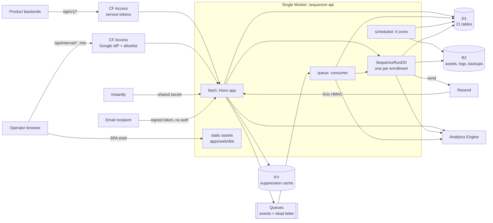
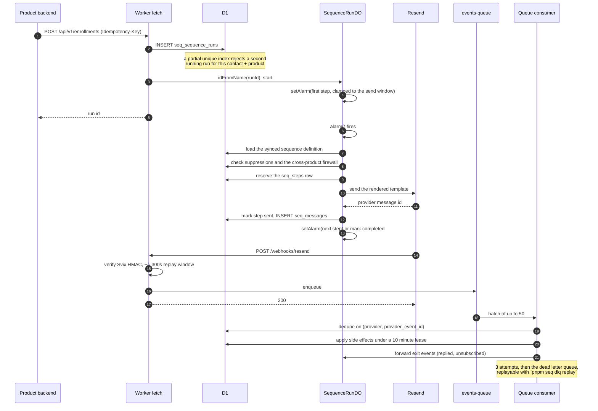
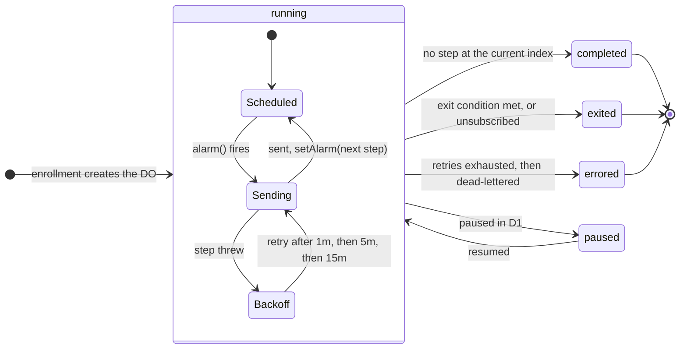
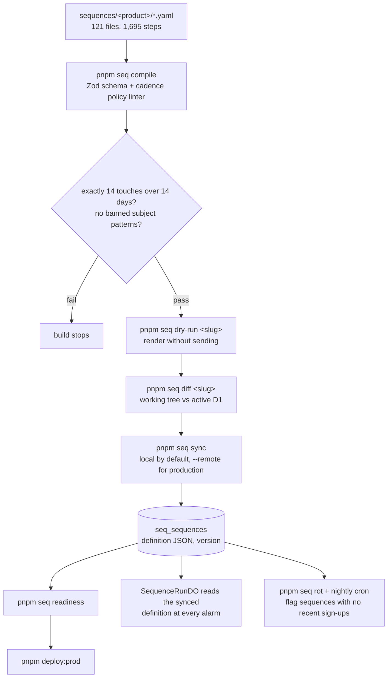

# Architecture

Sequencer is a multi-tenant email sequence engine that runs entirely on Cloudflare's edge
platform. One Worker deployment carries the product API, the operator dashboard, the
provider webhook endpoints, the queue consumer, and the cron jobs. Per-enrollment state
lives in a Durable Object; everything durable lives in D1, KV, or R2.

- [Request and auth topology](#request-and-auth-topology)
- [The lifecycle of one email](#the-lifecycle-of-one-email)
- [The SequenceRunDO state machine](#the-sequencerundo-state-machine)
- [From YAML to a running sequence](#from-yaml-to-a-running-sequence)
- [Data model](#data-model)
- [Background work](#background-work)

## Request and auth topology

Three authentication regimes coexist on one Worker, plus one deliberately unauthenticated
path. Which regime applies is decided by URL prefix in
[apps/api/src/index.ts](../apps/api/src/index.ts).

| Surface | Who calls it | How it is authenticated |
| --- | --- | --- |
| `/api/v1/*`, `/api/client/v1/*` | Product backends | Cloudflare Access **service tokens**. The Worker maps the Access-verified client id (which must end in `.access`) to a product via `seq_api_tokens`. |
| `/api/internal/*`, `/me` | The operator dashboard | Cloudflare Access **Google IdP**, then an explicit email allowlist checked against the verified JWT. |
| `/webhooks/{resend,instantly}` | Email providers | Access is bypassed so providers can reach the Worker; the Worker verifies instead. Resend uses Svix HMAC-SHA256, Instantly a shared-secret header. |
| `GET /unsubscribe` | Email recipients | Unauthenticated by necessity (RFC 8058 one-click). Safety comes from an HMAC-signed token in the link. |

The SPA is served as static assets by the same Worker. `run_worker_first` in
[apps/api/wrangler.toml](../apps/api/wrangler.toml) lists the paths the Worker must handle
before the asset handler sees them; everything else falls through to the single-page-app
handler.

## The lifecycle of one email

This is the path that most of the interesting engineering sits on. Idempotency, the
send window, suppression, retries, and the webhook boundary all appear here.

Two details worth pulling out:

**The webhook handler does almost nothing.** It verifies the signature, enqueues, and
returns 200. All the interpretation happens in the queue consumer. That keeps the provider's
retry behaviour simple and means a slow database cannot cause a provider to mark the
endpoint unhealthy.

**The DO reconciles against D1 on every wake.** Durable Object storage is not treated as the
sole source of truth: `alarm()` reloads the run's status from D1 first and exits locally if
D1 says the run is no longer running. An operator cancelling a run in the dashboard is
therefore authoritative even though the DO holds its own copy of the state.

## The SequenceRunDO state machine

One Durable Object instance per enrollment, named by the run id, driven entirely by
`state.storage.setAlarm()`. Source:
[apps/api/src/durable-objects/sequence-run.ts](../apps/api/src/durable-objects/sequence-run.ts).

The five persisted statuses come from `seq_sequence_runs.status`. Step retry is deliberately
modelled as a loop *inside* `running` rather than a top-level state, because a retrying step
does not change the run's persisted status.

Retries are re-scheduled through the same send-window logic as normal steps, so a failure at
16:55 does not produce a retry at 17:55 outside the contact's allowed hours.

## From YAML to a running sequence

Sequence definitions are authored as YAML, validated and compiled by the `seq` CLI, then
synced into D1. The Durable Object reads the synced definition from D1 at every alarm, so a
running enrollment always executes against a definition that was explicitly published.

Full DSL reference: [SEQUENCE-DSL.md](SEQUENCE-DSL.md).

## Data model

21 tables in D1, all prefixed `seq_`, across 33 Drizzle migrations. Schema lives in
[packages/db/src/schema/](../packages/db/src/schema/).

**Identity**
`seq_contacts`, `seq_contact_products`, `seq_contact_sources`, `seq_lists`, `seq_list_members`.
Contacts are global; membership, status, and unsubscribe scope are per product, which is what
makes one contact able to be active in one product and unsubscribed from another.

**Sequence definition**
`seq_products`, `seq_sequences`, `seq_templates`, `seq_lead_magnets`. `seq_sequences` holds the
compiled definition JSON plus a version, which the DO checks before every send.

**Runtime**
`seq_sequence_runs`, `seq_steps`, `seq_messages`, `seq_events`. This is where the invariants
live: one partial unique index on runs, one unique index on `(run_id, step_index)`, one on
`seq_messages.step_id`.

**Deliverability**
`seq_suppressions`, `seq_domain_health`, `seq_instantly_campaigns`,
`seq_instantly_campaign_daily_stats`, `seq_instantly_suppression_jobs`.

**Platform**
`seq_api_tokens`, `seq_audit_log`, `seq_rate_limit_windows`.

The indexes that carry real semantics rather than just performance:

| Index | Table | What it guarantees |
| --- | --- | --- |
| `idx_runs_one_running_per_contact_product` | `seq_sequence_runs` | Partial unique on `(contact_id, product_id) WHERE status = 'running'`. At most one active sequence per person per product, enforced by the database. |
| `idx_steps_run_step_unique` | `seq_steps` | A run cannot produce two rows for the same step index. |
| `idx_messages_step_unique` | `seq_messages` | A step cannot produce two sends. |
| `idx_suppressions_global_unique` | `seq_suppressions` | Partial unique on email where scope is global. |
| `idx_suppressions_product_unique` | `seq_suppressions` | Partial unique on `(email, product_id)` where scope is product. |

Migration integrity is itself tested: [packages/db/src/\_\_tests\_\_/migrations.test.ts](../packages/db/src/__tests__/migrations.test.ts)
asserts the journal, SQL files, and Drizzle snapshots stay 1:1 and in a linear chain, and that
the expand-migrate-contract migrations did what they claimed.

## Background work

**Queue consumer** ([apps/api/src/queues/consumer.ts](../apps/api/src/queues/consumer.ts))
Consumes `events-queue` in batches of up to 50, with 3 retries and a real dead letter queue.
Handles eleven Resend event types plus Instantly events. Malformed bodies and duplicates are
acked rather than retried; only transient failures retry.

**Cron triggers** ([apps/api/src/crons/index.ts](../apps/api/src/crons/index.ts))

| Schedule | Job |
| --- | --- |
| `0 * * * *` | Hourly Instantly cold-stats sync, plus suppression-job retries |
| `0 3 * * *` | Domain health rollup |
| `30 3 * * *` | Rot detector: flag active sequences with no recent enrollments |
| `0 4 * * *` | D1 backup to R2, written in chunks with retry on transient put failures |

Each cron run is wrapped in a Sentry check-in monitor whose slug is derived from the cron
expression, so a job that silently stops running is itself an alert.
